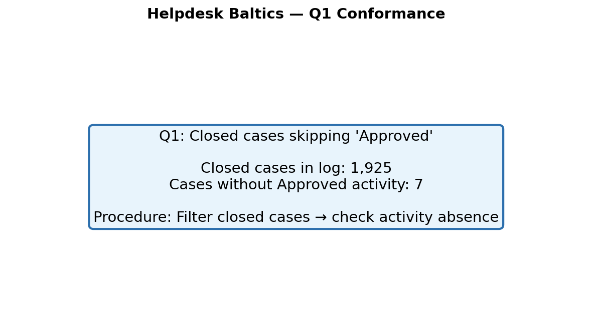
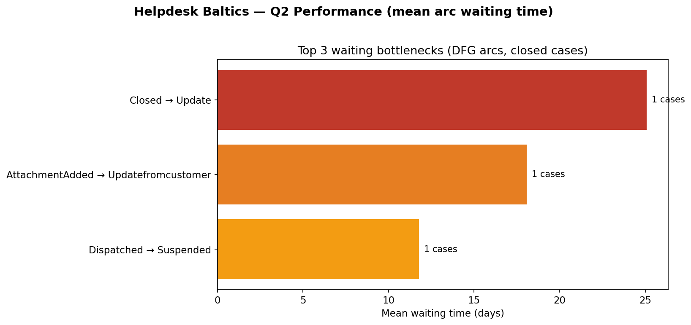
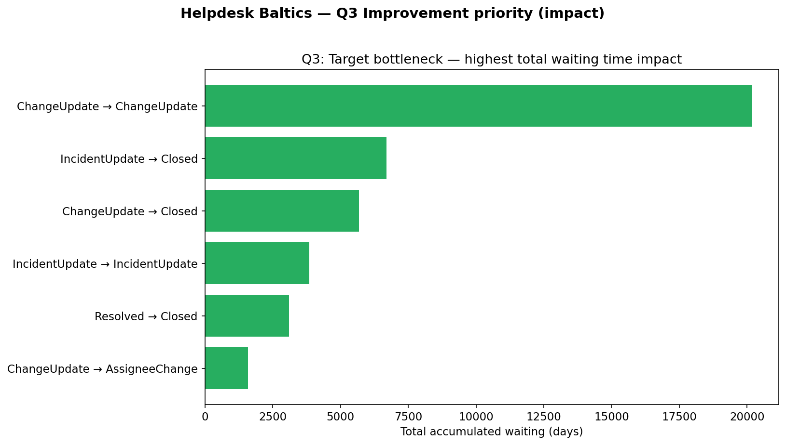
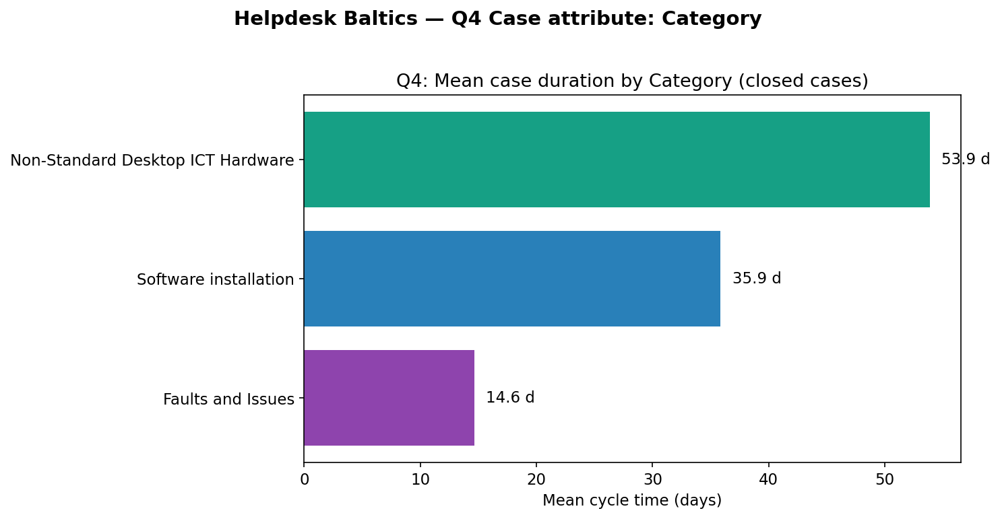
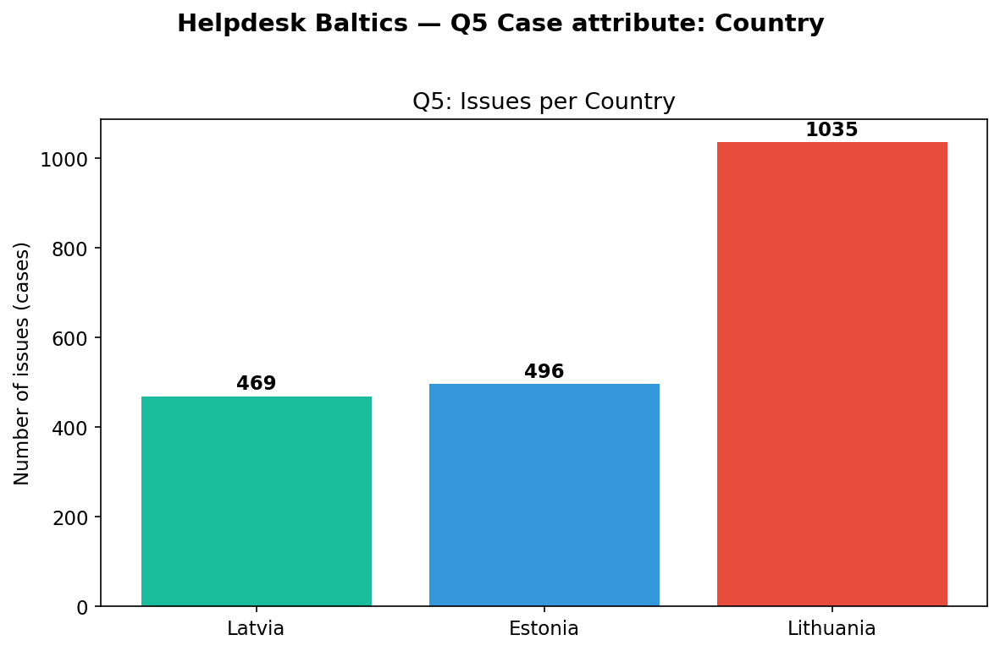
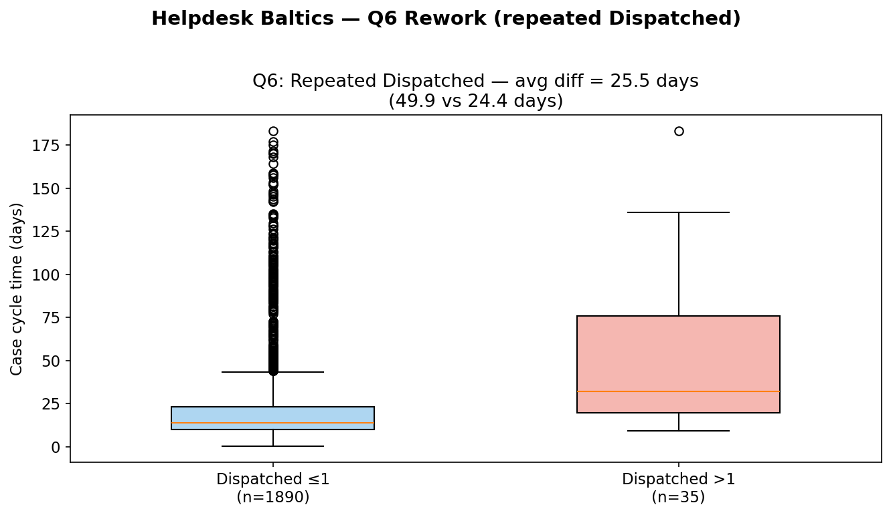
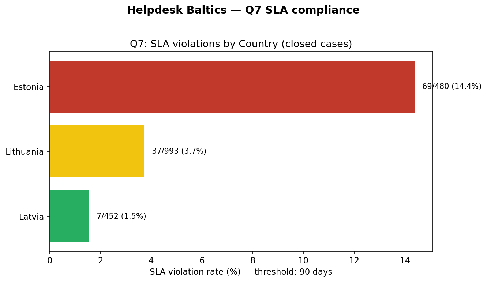
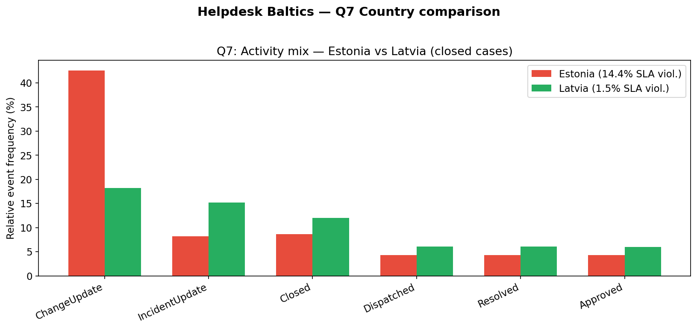

# Business Process Mining Exam — Helpdesk Baltics

**Event log:** Helpdesk-Baltics.csv  
**Case ID:** `Ticket` | **Activity:** `Status` | **Timestamp:** `Time`  
**Case attributes:** `Category`, `Country` | **Closed case:** trace contains `Closed`

| Metric | Value |
|--------|-------|
| Cases | 2,000 |
| Events | 36,972 |
| Closed cases | 1,925 |

---

## Question 1

7 closed cases skipped the Approved activity.



---

## Question 2

Three main waiting bottlenecks (closed cases, highest mean waiting time on directly-follows transitions):

1. Closed → AttachmentDeleted: 25.1 days (1 case)
2. Update → Closed: 8.8 days (7 cases)
3. Updatefromcustomer → Closed: 8.8 days (12 cases)



---

## Question 3

**Bottleneck to target:** ChangeUpdate → ChangeUpdate.

**Why:** Rank by total accumulated waiting time. ChangeUpdate → ChangeUpdate has the largest impact (~20,142 days total). Also prioritize IncidentUpdate → Closed (8.2 days mean, 710 occurrences) and ChangeUpdate → Closed (8.3 days mean, 679 occurrences).

**Suggestion:** Reduce ChangeUpdate rework loops and shorten the finalization phase (updates → Closed).



---

## Question 4

**Longest average time to close:** Non-Standard Desktop ICT Hardware (53.9 days mean, 50.8 days median, 66 closed cases).

| Category | Mean cycle time |
|----------|-----------------|
| Non-Standard Desktop ICT Hardware | 53.9 d |
| Software installation | 35.9 d |
| Faults and Issues | 14.6 d |

**Focus improvement on:** Non-Standard Desktop ICT Hardware.



---

## Question 5

**Country with the highest number of issues:** Lithuania (1,035 cases).

| Country | Cases |
|---------|-------|
| Lithuania | 1,035 |
| Estonia | 496 |
| Latvia | 469 |



---

## Question 6

| Metric | Value |
|--------|-------|
| Closed cases with Dispatched **> 1** | **35** |
| Avg case duration (Dispatched > 1) | **49.9 days** |
| Avg case duration (Dispatched ≤ 1) | **24.4 days** |
| **Difference** | **25.5 days** |

Repeated dispatch is associated with much longer case duration (rework).



---

## Question 7

**SLA:** Close within 90 days (3 months). Violation if cycle time > 90 days (closed cases).

| Country | Violation % |
|---------|-------------|
| **Estonia (highest)** | **14.4%** (69 / 480) |
| Lithuania | 3.7% (37 / 993) |
| **Latvia (lowest)** | **1.5%** (7 / 452) |

**Estonia vs Latvia:**
- Mean cycle time: Estonia 37.2 d vs Latvia 17.3 d
- Category mix: more Software installation in Estonia (49.6% vs 38.1%)
- Activity mix: more ChangeUpdate in Estonia (42.5% vs 18.2%)
- After Dispatched: Dispatched → ChangeUpdate mean wait 3.4 d (Estonia) vs 0.3 d (Latvia)
- Skipping Approved is rare in both — not the main SLA driver





---

## Code submitted

| File | Purpose |
|------|---------|
| `helpdesk_analysis.py` | All 7 questions |
| `exam_answers.py` | Answers for PDF/report |
| `helpdesk_report.py` | Extra detail (Q1 IDs, EE vs LV) |
| `generate_screenshots.py` | Charts |
| `generate_pdf_report.py` | PDF |

Run: `python helpdesk_analysis.py`

